# AWS EKS CI/CD Pipeline for Containerized Web Application

## Project Overview

This project demonstrates a complete end-to-end DevOps CI/CD pipeline built using GitHub, Jenkins, Docker, Kubernetes, and Amazon EKS.

A static web application is containerized using Docker, automatically built and pushed to Docker Hub through Jenkins, and deployed on an Amazon EKS Kubernetes cluster whenever code changes are pushed to GitHub.

The entire deployment process is automated using GitHub Webhooks and Jenkins Pipeline.

---

## Architecture

```text
Developer
    │
    ▼
GitHub Repository
    │
    │ GitHub Webhook
    ▼
Jenkins Pipeline
    │
    ├── Build Docker Image
    ├── Push Image to Docker Hub
    ├── Update Kubernetes Deployment
    ▼
Amazon EKS Cluster
    │
    ▼
Kubernetes Deployment
    │
    ▼
LoadBalancer Service
    │
    ▼
Live Website
```

---

## Tech Stack

- AWS EC2
- Amazon EKS
- Kubernetes
- Docker
- Docker Hub
- Jenkins
- Git
- GitHub Webhooks
- Apache Web Server
- Ubuntu Linux

---

## Key Features

- Automated CI/CD Pipeline
- GitHub Webhook Integration
- Docker Image Versioning
- Kubernetes Deployment Automation
- Rolling Updates
- Amazon EKS Managed Kubernetes
- External LoadBalancer Exposure
- Containerized Apache Web Application

---

## Project Workflow

### Step 1: Source Code Management

Application source code is stored in GitHub.

Whenever a developer pushes code:

- GitHub webhook is triggered
- Jenkins automatically starts a new build

---

### Step 2: Docker Build

Jenkins:

- Clones source code
- Builds Docker image
- Tags image using Jenkins build number

Example:

```bash
sanketjadhav84/sanket-main-project:3
```

---

### Step 3: Docker Hub Push

The generated image is pushed to Docker Hub.

Repository:

```text
sanketjadhav84/sanket-main-project
```

---

### Step 4: Kubernetes Deployment

Jenkins connects to AWS EKS and:

- Updates deployment image
- Performs rolling update
- Verifies rollout status

---

### Step 5: Application Exposure

A Kubernetes LoadBalancer Service exposes the application publicly.

Users can access the application through the AWS Load Balancer DNS endpoint.

---

# Screenshots

## AWS Infrastructure

### EC2 Instances

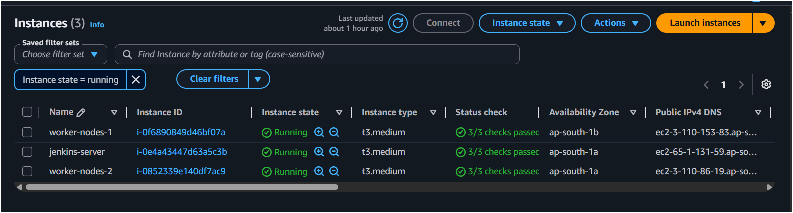

Two Kubernetes worker nodes and one Jenkins server running on AWS.

---

### Amazon EKS Cluster

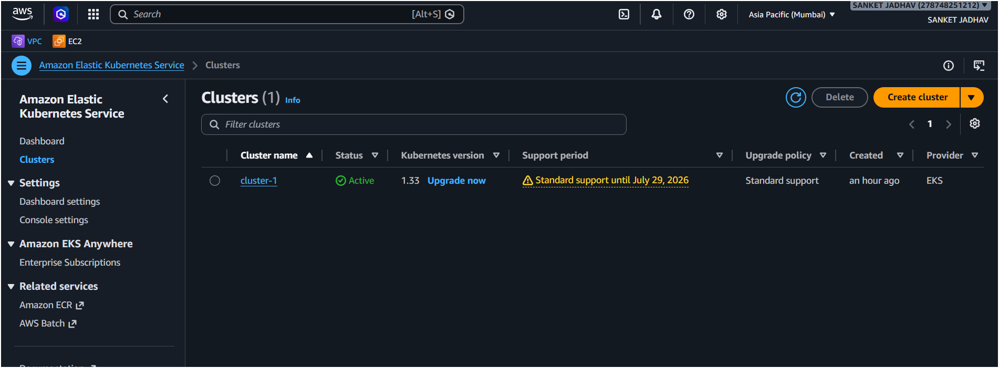

Active EKS cluster hosting Kubernetes workloads.

---

### AWS Load Balancer

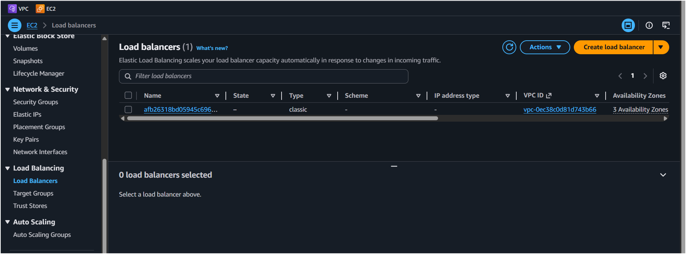

LoadBalancer automatically provisioned by Kubernetes Service.

---

## Docker

### Docker Hub Repository

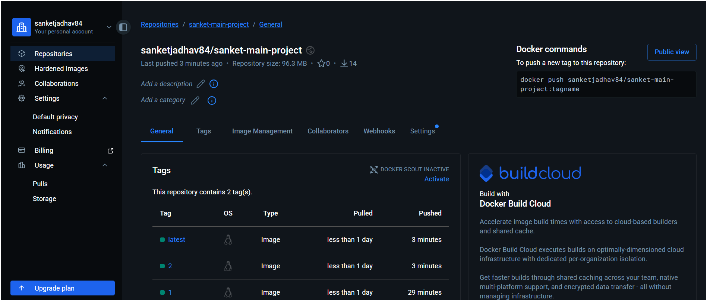

Docker images automatically pushed from Jenkins.

---

## Jenkins Automation

### Pipeline Triggered by GitHub Webhook

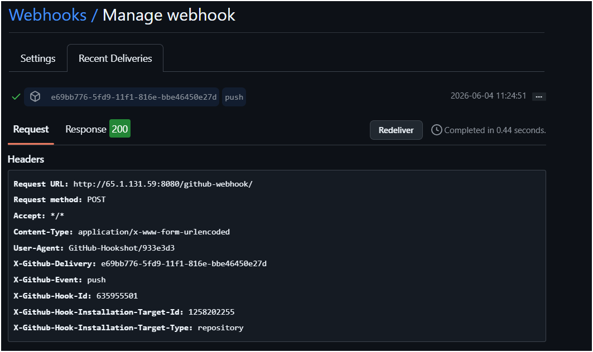

Automatic build triggered after GitHub push.

---

### Successful Jenkins Pipeline

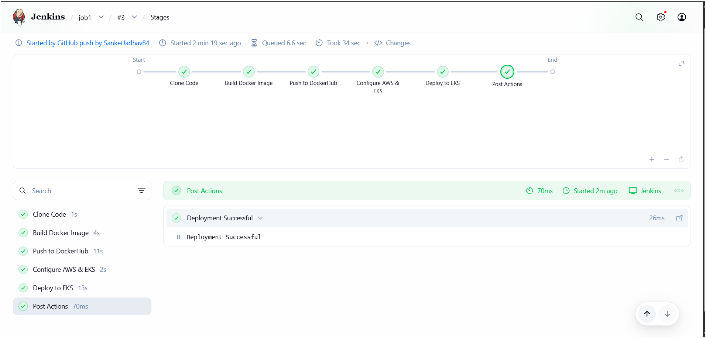

Pipeline stages:

- Clone Code
- Build Docker Image
- Push Docker Image
- Configure AWS & EKS
- Deploy to EKS

---

## Kubernetes

### Worker Nodes

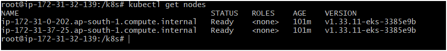

Worker nodes registered successfully with EKS.

---

### Kubernetes Deployment

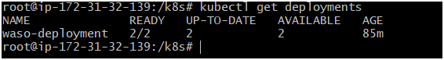

Deployment running with desired replicas.

---

### Kubernetes Pods

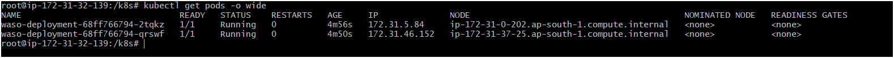

Application pods running successfully.

---

## Live Application

### Application Before Deployment

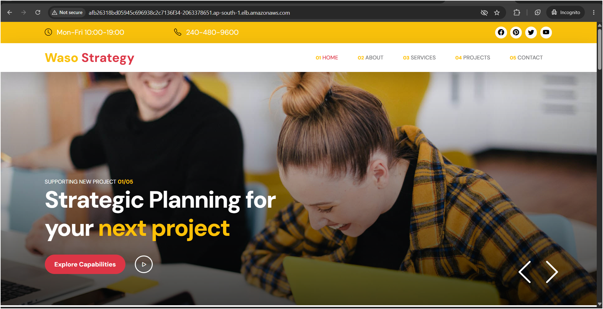

---

### Application After Automated Deployment

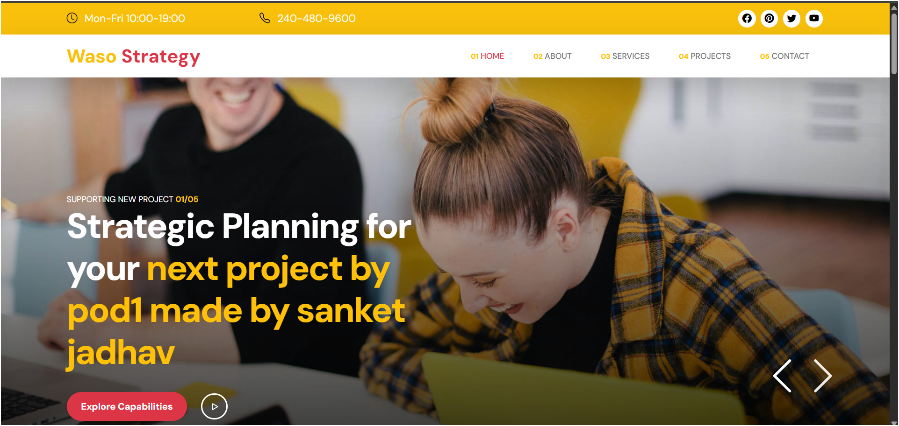

Updated content deployed automatically through CI/CD pipeline.

---

## Dockerfile

```dockerfile
FROM ubuntu

RUN apt-get update && apt-get install -y apache2

COPY . /var/www/html

CMD ["/usr/sbin/apache2ctl", "-D", "FOREGROUND"]
```

---

## Jenkins Pipeline Stages

1. Clone Source Code
2. Build Docker Image
3. Push Docker Image to Docker Hub
4. Configure AWS Credentials
5. Connect to Amazon EKS
6. Deploy to Kubernetes
7. Verify Rollout Status

---

## Project Outcome

Successfully implemented a production-style CI/CD workflow that automatically:

- Builds Docker images
- Pushes images to Docker Hub
- Deploys applications to Amazon EKS
- Performs rolling updates
- Exposes application using AWS Load Balancer

---

## Author

**Sanket Jadhav**

DevOps Engineer

Technologies:
AWS | Docker | Kubernetes | Jenkins | GitHub | Linux